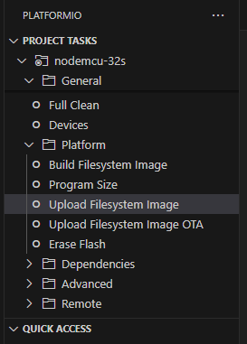

Para cambiar las credenciales WIFI hay que entrar en el archivo WebServer.cpp
La URL de la pagina es HTTP://alarma.local   es asi porque ya tiene DNS

###############################
ANTES DE CARGAR EL CODIGO, IR AL ICONO DE PLATFORMIO, DESPUES IR A LA CARPETA PLATFORM, APRETAR EN COMPILAR IMAGEN FILESYSTEM
DESPUES SUBIR IMAGEN FILESYSTEM
ESO ES PARA CARGAR LOS ARCHIVOS DE LA PAGINA WEB AL ESP
UNA VEZ CARGADOS, CARGAR EL PROYECTO AL ESP32.

